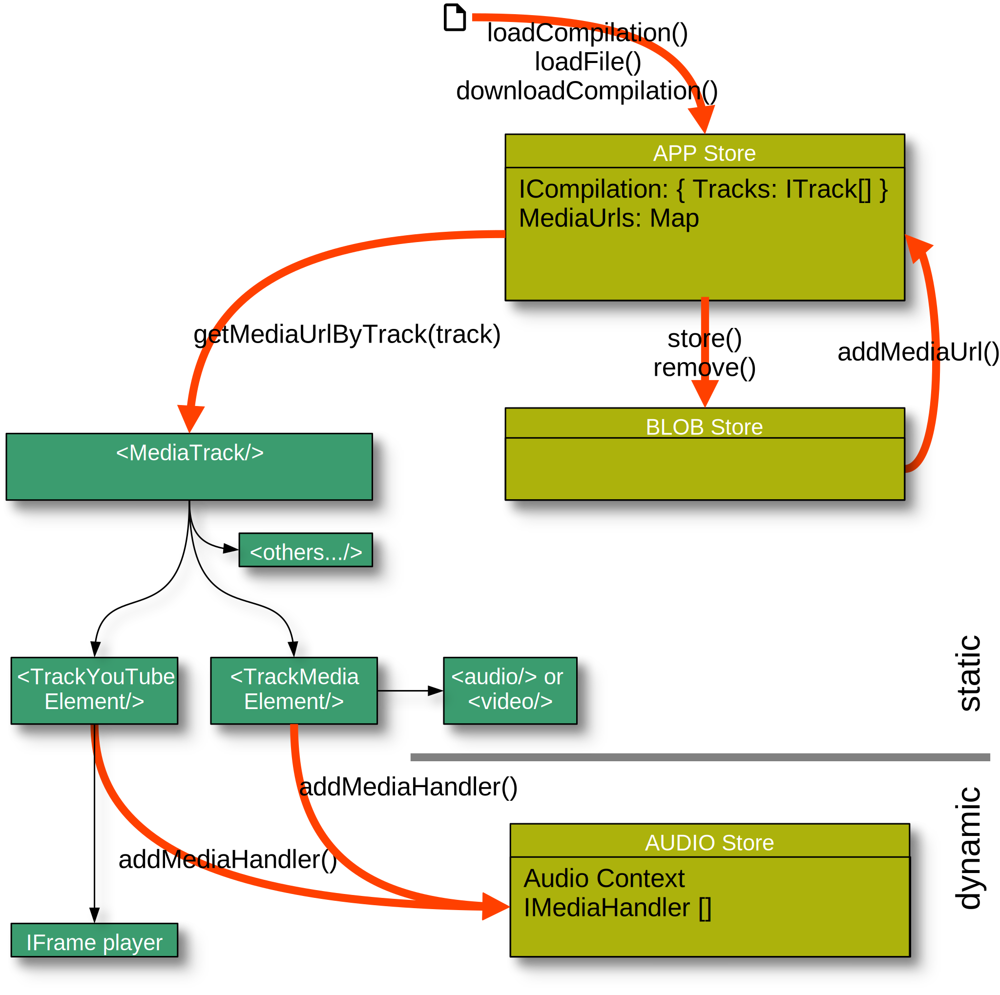

# [Replayer](https://replayer.app/) technical architecture documentation

## Main concepts

Replayer has 3 main concepts:

- An **application store for the application state**, that handles loading and unloading of complete compilations as well as single tracks, with or without accompanying files. The loaded files are kept in a separate object store, either as handles to the file system or as BLOB's in the IndexedDB.
- A **unified playback handling** via the ```IMediaHandler``` interface, and an audio store for these handlers.
- Various **track implementations**, as SFC components, which make use of and arbitrate between the two concepts above. Tracks get their data from the application store (and BLOB store, if necessary). They then instantiate and provide a suitable ```IMediaHandler``` implementation to the audio store, for the the actual playback handling.


_Illustration: main concepts_