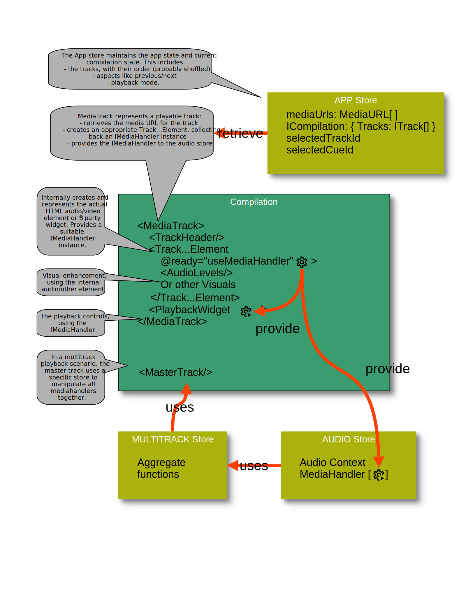
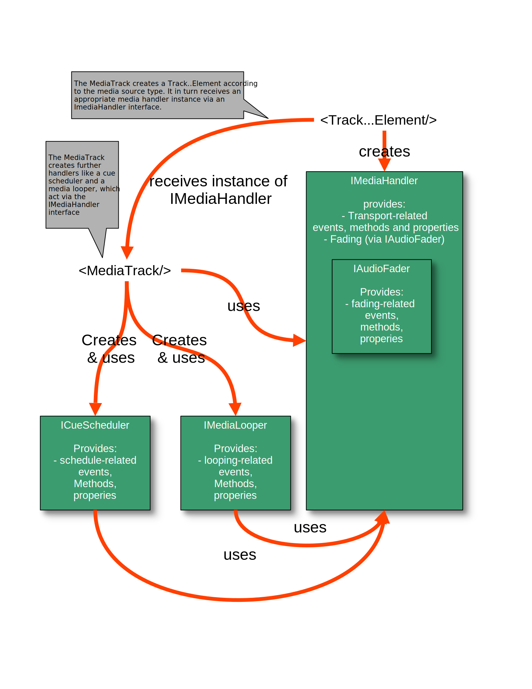

# [Replayer](https://replayer.app/) technical media handling documentation

## Supported media

Replayer currently handles

-   online and offline audio files
-   online and offline video files
-   Youtube videos

A future version also may handle

-   Spotify tracks
-   Vimeo videos
-   Soundcloud tracks

For handling the media sources in a suitable way for Replayer, various classes/modules encapsulate the necessary features for each type of source.

## Media handling

A media handler instance (e.g. class `HtmlMediaHandler` of `IMediaHandler`) implements and provides all necessary manipulation features for the media of a Replayer track, including

-   Play/Pause/Stop
-   Looping
-   Seeking
-   Current position
-   Mute/Solo state
-   Volume
-   Fading handling
-   Detune/pitch shift handing (planned)

The underlying source (HTML media element or some widget in case of 3rd party sources) is intentionally not exposed, all manipulation must be carried out via the Handler.

If outside access to the underlying media source is required (e.g. for additional visualization), it must be implemented separately from the handler.

The following picture gives an overview of this architecture:

## Media Handler architecture

The media handler interface `IMediaHandler` defines all necessary basic manipulations for a Replayer track (see above). It does so by either defining the methods on itself, or by providing further interfaces for it (e.g. `IAudioFader`).

The `MediaTrack` component then makes use of the `IMediaHandler` features by itself, plus it also creates further handlers for more advanced features like cue scheduling and looping, that also build upon the basic features from `IMediaHandler`.

## Using the stores

The Replayer state is stored in [various stores](../store/README.md). For the media handling, the Object URL's from the App store are used, and for each playable track, a suitable media component is created. The resulting handlers are then provided to the Audio store.
