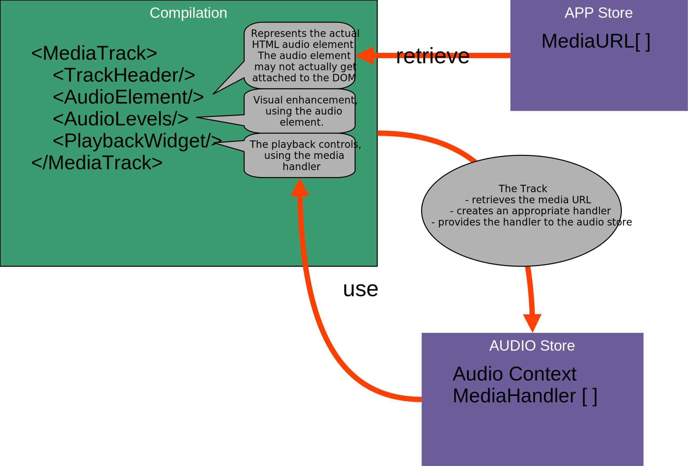

# [Replayer](https://replayer.app/) technical media handling documentation

## Supported media

Replayer currently handles

-   online and offline audio files

A future version also may handle

-   online and offline video files
-   Spotify tracks
-   Youtube videos
-   Vimeo videos
-   Soundcloud tracks

For handling the media sources in a suitable way for Replayer, various implementations encapsulate the necessary features for each type of source.

## Media Handler interface

A media handler (e.g. class `MediaHandler` of `IMediaHandler`) provides all neccessary manipulation features for the media of a Replayer track, including

-   Play/Pause/Stop
-   Looping
-   Seeking
-   Current position
-   Mute/Solo state
-   Volume
-   Fading handling

The underlying source (HTML media element or widget in case of 3rd party sources) is intentionally not exposed, all manipulation must be carried out in the Handler.

If outside access to the underlying media source is required (e.g. for additional visualization), it must be facilitated before or at creation of the handler.

## Using the stores

The Replayer state is stored in [various stores](../store/README.md). For the media handling, the Object URL's from the App store are used, and the handlers are then provided to the Audio store.

The following picture gives an overview of this architecture:

