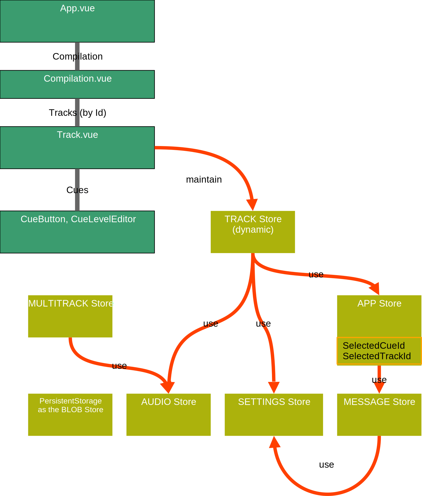

# [Replayer](https://replayer.app/) technical state and store documentation

## Stores

Replayer internally uses [Pinia](https://pinia.vuejs.org/) for storing most part of the state. All pinia stores are persisted in the _Local Storage_.

To learn more about the terms, see the [glossary](https://replayer.app/documentation/glossary).

The complete Replayer state consists of these parts:

### App store

The **APP** store contains the application state. This includes

-   all available playback metadata (including the compilation's tracks with cues).
-   It also includes the **currently selected cue or track**'s GUID, which can represent any single cue (of a track) or track without specifying cue, or none, of a compilation. The key used are `selectedCueId` or `selectedTrackId`, respectively.
    _Note: This is not equal to a playback position._
-   The **media URL's** (of class `MediaUrl`, which contain [object URL's for accessing local resources](https://developer.mozilla.org/en-US/docs/Web/API/URL/createObjectURL_static#see_also). These are locally loaded files or extracted files from a ZIP package.
    _Note: Online media resources are not stored as media URL's._

### Messages store

The **MESSAGES** store represents all current display messages.

### Settings store

The **SETTINGS** store represents the various application options, including experimental options.

### Audio store

The **AUDIO** store represents the **audio environment**, consisting of the [Web Audio API context](https://developer.mozilla.org/en-US/docs/Web/API/Web_Audio_API/Using_Web_Audio_API#audio_context) and an object reference to the individual handlers for each track's media media source.

### BLOB store

The set of local **media files**, as BLOBs, for playback with the compilation's tracks are persisted individually. Because of their size, they are stored in the _IndexedDB_, with the key referencing a track's media URL.

### Store access

Most components typically do not access the store directly, following the [dumb component pattern](https://namingconvention.org/vuejs/smart-dumb-naming.html).

The following picture gives an overview:

