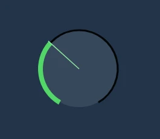

# Vue Control Knob

Rotary control knob component for Vue 3 that behaves like native audio app controls in Logic Pro or Ableton Live. Component is fully customizable and rendered as an ARIA-friendly SVG element.




## Features:

- Supports **keyboard, mouse & wheel control**
- Changes input only with **vertical mouse movement**
- **Precice mode** using shift + movement
- **Reset to default** with Option-click (alt-click)
- **Zero dependencies** (apart from Vue 3)
- **Fully configurable** and **Tailwind CSS -friendly** styles
- Witten in **TypeScript**, ships with typings

## Installation

1. Install the package from npm: `yarn add @slipmatio/control-knob`
1. Import Vue component to your project: `import ControlKnob from '@slipmatio/control-knob'`
2. Configure v-model and options

### Configuration

All configuration options are optional. The options referencing inner coordinate positions are based on 100x100 coordinate system that is not affected by the imageSize.

| Option | Default | Description |
| --- | --- | --- |
| imageSize | 40 | Rendered SVG width and lenght in pixels. |
| minValue | 0 | Minimum value of the knob v-model. |
| maxValue | 100 | Maximum value of the knob v-model. |
| showTick | true | Show visible marker of the knob position. |
| showValue | true | Show value label inside the knob. |
| hideDefaultValue | false | Hide value label if value hasn't been changed. |
| tickLength | 18 | Tick length in pixels. |
| tickOffset | 10 | Tick offset in pixels. |
| tickStroke | 3 | Tick stroke width. |
| rimStroke | 11 | Outer rim stroke width. |
| valueArchStroke | 11 | Value arch stroke width. |
| bgRadius | 34 | Radius of the background circle. |
| wheelFactor | 10 | Modifier to factor any mousewheel ticks. |
| keyFactor | 10 | Modifier to factor any arrow-key presses. |
| tabIndex | 0 | Tabindex for the HTML element. |
| ariaLabel | 'Knob' | ARIA label for the HTML element. |
| valueTextX | 50 | X-position of the value text label. |
| valueTextY | 62 | Y-position of the value text label. |
| svgClass | 'select-none' | CSS class for the SVG element. |
| bgClass | 'text-[#868686]' | CSS class for the background circle. |
| rimClass | 'text-[#393939]' | CSS class for the outer rim. |
| valueArchClass | 'text-[#53d769]' | CSS class for the value arch. |
| tickClass | 'text-black' | CSS class for the tick line. |
| valueTextClass | 'text-gray-50 text-[30px] font-normal font-mono' | CSS class for the value text. |
| passiveEvents | false | When set, propagation of handeled events is not prevented. |

**Note** that if you're using Tailwind CSS with automatic purge, you'll probably want to add the default classes as options so PurgeCSS catches them (or you can just whitelist them):

Default Tailwind CSS classes:

```js
const options = {
  svgClass: 'select-none',
  bgClass: 'text-[#868686]',
  rimClass: 'text-[#393939]',
  valueArchClass: 'text-[#53d769]',
  tickClass: 'text-black',
  valueTextClass: 'text-gray-50 text-[30px] font-normal font-mono',
}
```
## Development

### Install dependencies

`yarn`

### Run development server

`yarn dev`

### Run tests

`yarn test`

## Contributing

Contributions are welcome! Please follow the [code of conduct](https://www.contributor-covenant.org/version/2/0/code_of_conduct/) when interacting with others.

## Elsewhere

[Follow @uninen](https://twitter.com/uninen) on Twitter